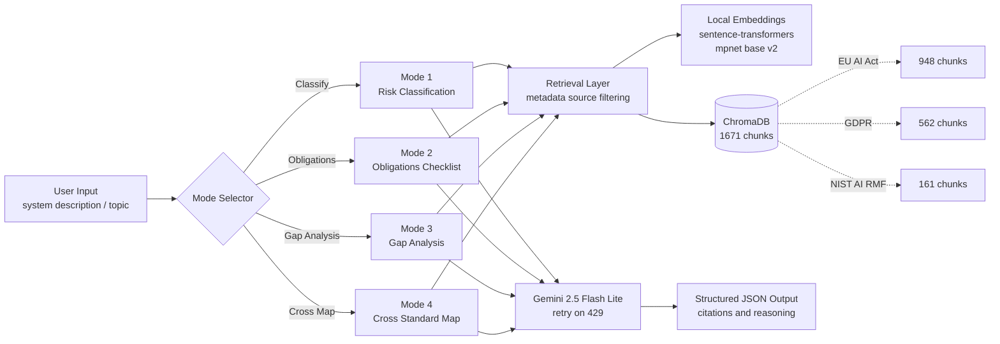

# AIActChecker
**Live demo:** https://aiactchecker.streamlit.app  
**Try it now** — no setup needed. Click any tab, try an example, see the output.
**Multi mode EU AI Act compliance analysis system.** Classify any AI system into EU risk tiers, generate the obligations checklist, audit current compliance state with prioritized gaps, and map requirements across the EU AI Act, GDPR, and NIST AI RMF — all with article level citations.

> **Status:** Active development. Core compliance logic (4 modes) shipped and validated. Integration layer (LangGraph orchestration, FastAPI, Streamlit UI) in progress.

---

## The Problem

The EU AI Act takes effect in August 2026. Any organization deploying AI in the EU must:

1. Classify each AI system by risk tier (Prohibited, High, Limited, Minimal)
2. Satisfy a long list of tier specific obligations
3. Demonstrate ongoing compliance across overlapping regulations such as the GDPR and the NIST AI Risk Management Framework

The law itself is 144 pages of legal text. Today most compliance answers come from expensive consulting engagements that produce slow, inconsistent outputs.

**AIActChecker automates this workflow as a callable software system.** Describe an AI system in plain language and the tool reads the regulations for you, returning structured analyses with citations.

---

## What It Does

### Mode 1 — Risk Classification

Classify an AI system into one of four EU AI Act risk tiers with article level reasoning.

**Input:** *"An AI tool that screens job applicants by scoring CVs and ranking candidates for HR teams."*

**Output:**
- Risk category: **HIGH**
- Citations: Annex III point 4(a), Article 6(2)
- Reasoning: Employment and worker management decisions fall under high risk
- Validated: 6 of 6 correct on diverse test cases (Prohibited, High, Limited, Minimal)

### Mode 2 — Obligations Checklist

For a classified system, generate the full list of obligations that apply, with concrete required actions.

**Output for a HIGH risk system:** A 13 item checklist covering Articles 9 (Risk Management), 10 (Data Governance), 11 (Technical Documentation), 12 (Record Keeping), 13 (Transparency), 14 (Human Oversight), 15 (Accuracy and Robustness), 17 (Quality Management), 43 (Conformity Assessment), 48 (CE Marking), 49 (EU Database Registration), 72 (Post Market Monitoring), and 73 (Serious Incident Reporting).

Each item includes the article reference and a plain language statement of what must be done.

### Mode 3 — Gap Analysis

Compare an organization's current implementation state against the obligations for its risk tier. Returns a structured audit with priority scoring.

**Input:** Risk category + description of current controls (e.g., human review of top candidates, audit logging, basic security)

**Output:**
- Compliance score: percentage (e.g. 23%)
- Per requirement status: MET, PARTIAL, or GAP
- Priority per gap: CRITICAL, HIGH, MEDIUM, LOW
- Recommended action for each gap
- Summary: total met / partial / gap counts and critical gap count

### Mode 4 — Cross Standard Map

Map a governance topic across the EU AI Act, the GDPR, and the NIST AI RMF. Useful when the same concept (data governance, human oversight, biometric data, etc.) appears across multiple frameworks with different scopes.

**Input:** A topic, for example *"Data Governance and Data Quality for AI Systems"*

**Output:**
- For each framework: primary references, summary, and key obligations
- Overlap analysis (where frameworks align)
- Differences (scope, strictness, binding vs voluntary)
- Practical compliance guidance (which framework is strictest, does complying with one cover the others)

---

## Architecture



**Design decisions worth calling out:**

- **Local embeddings over the Gemini embedding API.** Started with `all-MiniLM-L6-v2` (384 dim) and got weak similarity scores on legal text (0.08 to 0.29). Switched to `all-mpnet-base-v2` (768 dim) and scores more than doubled. Local also bypasses the 100 per minute embed API rate limit.
- **Metadata based source filtering at query time.** After expanding the corpus from one document to three, queries about the EU AI Act started pulling GDPR pages because of topical overlap. Solved by filtering on `source` metadata so each mode can target the right document subset while still allowing cross framework reasoning when needed.
- **Single LLM call gap analysis.** Mode 3 originally chained three LLM calls (classify, then obligations, then gap analysis) and kept blowing the per minute token budget. Refactored to one LLM call per gap analysis by hardcoding obligations per risk tier (these come from the law, not the model) and accepting an optional pre classified risk category as input.
- **Retry logic that reads Google's suggested delay.** Free tier rate limits return a suggested retry delay in the 429 response. The retry layer parses that and waits accordingly, rather than using fixed backoff.

---

## Tech Stack

| Layer | Choice | Why |
|---|---|---|
| **Generation** | Gemini 2.5 Flash Lite | Highest free tier (15 RPM, 1000 RPD), fast, good at structured output |
| **Embeddings** | sentence-transformers `all-mpnet-base-v2` (local, 768 dim) | Strong on legal text, no API rate limit |
| **Vector store** | ChromaDB (persistent, local) | Simple, fast, metadata filtering built in |
| **Language** | Python 3.13 | Standard for the LLM stack |
| **Document ingestion** | PyMuPDF | Robust PDF parsing |
| **SDK** | `google-genai` (current SDK, not the deprecated `google-generativeai`) | Future proof |
| **Planned** | LangGraph (orchestration), FastAPI (API layer), Streamlit (UI) | Coming in the next phase |

---

## Setup

### Prerequisites

- Python 3.10 or newer
- A Google AI Studio API key for Gemini (free tier works fine)

### Install

```bash
git clone https://github.com/sreeja1105/aiactchecker.git
cd aiactchecker
python -m venv .venv
source .venv/bin/activate     # on Windows: .venv\Scripts\activate
pip install -r requirements.txt
```

### Configure

Create a `.env` file in the project root (copy from `.env.example`):

```env
GOOGLE_API_KEY=your_gemini_api_key_here
```

### Ingest the corpus

The three regulatory documents need to be downloaded and indexed once.

```bash
python scripts/download_docs.py    # downloads EU AI Act, GDPR, NIST AI RMF PDFs
python scripts/ingest_docs.py      # chunks them and writes to ChromaDB
```

This takes about 5 minutes on first run (embeddings happen locally).

### Test the modes

```bash
python scripts/test_classify.py        # Mode 1
python scripts/test_obligations.py     # Mode 2
python scripts/test_gap_analysis.py    # Mode 3
python scripts/test_cross_map.py       # Mode 4
```

---

## Features

- **Risk Classification** — Categorize any AI system into Prohibited, High, 
  Limited, or Minimal risk with cited reasoning
- **Obligations Checklist** — Generate the full set of EU AI Act obligations 
  for the system's risk tier, with article references
- **Gap Analysis** — Audit current implementation against obligations, get a 
  compliance score, and receive a prioritized action plan
- **Cross-Standard Map** — Compare requirements across the EU AI Act, GDPR, 
  and NIST AI RMF for any governance topic
- **PDF and Markdown Reports** — Export findings for sharing with leadership 
  or auditors
- **Live Web Interface** — Try it at https://aiactchecker.streamlit.app

---

## Notes On Constraints

This was built end to end on free tier Gemini (15 RPM, 1000 RPD, 250K TPM). Most architecture decisions were shaped by those limits: local embeddings instead of API embeddings, single LLM call per gap analysis instead of three, retry logic that respects the API's own suggested delays. Working under real constraints produced cleaner architecture than an unlimited budget would have.

---

## Repository Structure

```
aiactchecker/
├── src/
│   ├── classify.py          # Mode 1
│   ├── obligations.py       # Mode 2
│   ├── gap_analysis.py      # Mode 3
│   ├── cross_map.py         # Mode 4
│   ├── retrieval.py         # ChromaDB retrieval with source filtering
│   ├── ingestion.py         # PDF parsing and chunking
│   ├── llm.py               # Gemini wrapper with retry logic
│   └── config.py            # Model names, paths, thresholds
├── scripts/
│   ├── download_docs.py
│   ├── ingest_docs.py
│   ├── test_classify.py
│   ├── test_obligations.py
│   ├── test_gap_analysis.py
│   └── test_cross_map.py
├── docs/                    # Source PDFs (gitignored)
├── data/chroma_db/          # Vector store (gitignored)
├── requirements.txt
├── .env.example
└── README.md
```

---

## Build Process

This project was built agent first using Claude as the primary coding pair. The agent handled most of the typing (data ingestion, retry logic, JSON schema design, refactors) while I directed the design, reviewed the output, and caught the bugs the agent missed.

Concrete examples of where verification mattered:

- The agent confidently expanded the corpus from one document to three without flagging the cross corpus retrieval pollution it was about to introduce. I caught that during testing and added the metadata based source filtering.
- The agent proposed the single LLM call refactor for Mode 3. I validated that the architecture made domain sense (obligations come from the law, not the model, so hardcoding them per risk tier is correct, not a shortcut).
- The agent's first embedding choice was MiniLM. The similarity scores were objectively weak on legal text. Swapping to mpnet base v2 was driven by inspecting the actual numbers, not by trusting the default.

The agent ships code roughly ten times faster. The cost is that I have to read every line, because the agent is confidently wrong sometimes. That trade is the right one.

---

## License

MIT

---

## Author

Kotha Sreeja — MSc Business Analytics and Data Science, EU Business School Munich  
github.com/sreeja1105 · linkedin.com/in/kotha-sreeja
